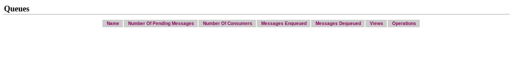
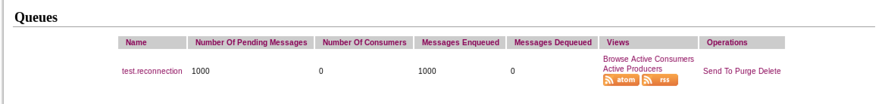

# Scenario 1
There are two active MQ connections both are active. 

First ActiveMQ queue

Second ActiveMQ queue

Played 1000 messages, now
First ActiveMQ queue

Second ActiveMQ queue

#### messages are equally distributed in both the queues

# Scenario 2
First activeMQ connection is not active, only second one is active.

Second activeMQ queue before test

Second activeMQ queue after test

