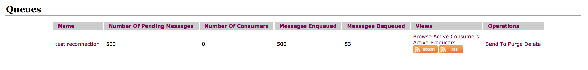
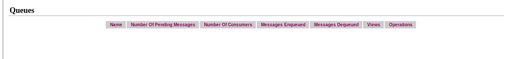
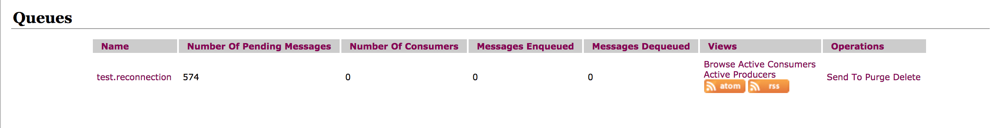
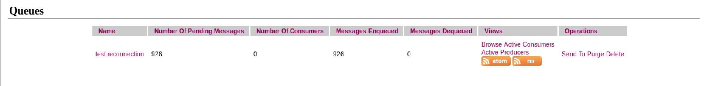
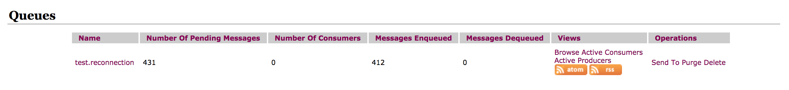
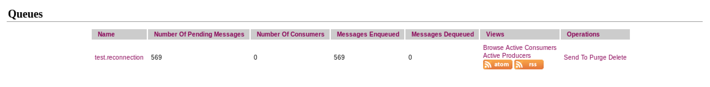

# Scenario 1
There are two active MQ connections both are active. 

First ActiveMQ queue

Second ActiveMQ queue

Played 1000 messages, now
First ActiveMQ queue

Second ActiveMQ queue

#### messages are equally distributed in both the queues (500,500)

# Scenario 2
First activeMQ connection is not active from the beginning of the test, only second one is active. Kept first one stopped througout the remaining part of the test.

Second activeMQ queue before test

Second activeMQ queue after test

# Scenario 3
Both the connections are active at the beginning of the test. Stopped first connection in the middle of the test. Kept first one througout the remaining part of the test.

First activeMQ queue before test

Second activeMQ queue before test

First activeMQ queue after test

Second activeMQ queue after test

Total number of messages consumed is 1000.
Messages consumed by the first queue is 74 (574 - 500)
Messages consumed by the second queue is 926

# Scenario 4
Till now whatever test we are doing, recover service is not tested. This one is for recovery, from the beginning first active MQ connection will be down. Somepoint of time during the test, it will be connected to check whether it is recovered and message delivered in the corresponding queue.

All the queues are purged and deleted.

After test number of messages in the first queue.

After test number of messages in the second queue.

What happens initially both the queues consumed messages. After consuming 19 messages, first activme was stopped. After a while it started again. Recovery service recovered the first connection. After that it consumed 412 messages.
total messages consumed by the first queue = 431
total messages consumed by the second queue = 569
total number of messages = 1000

